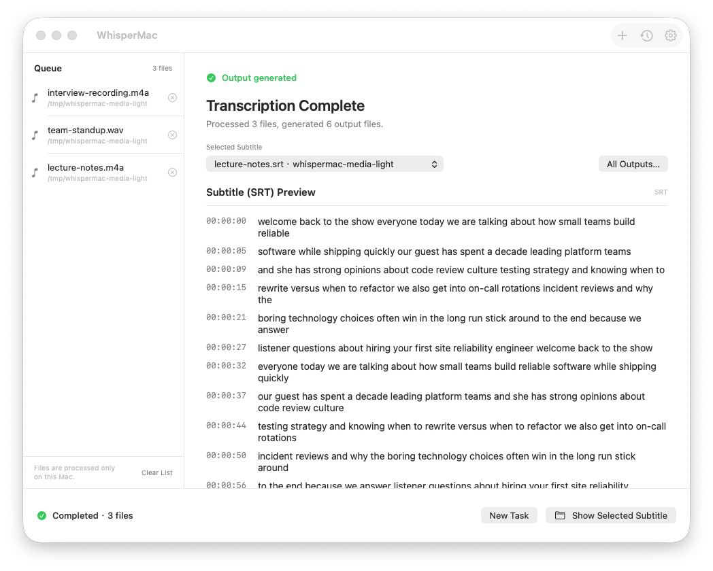
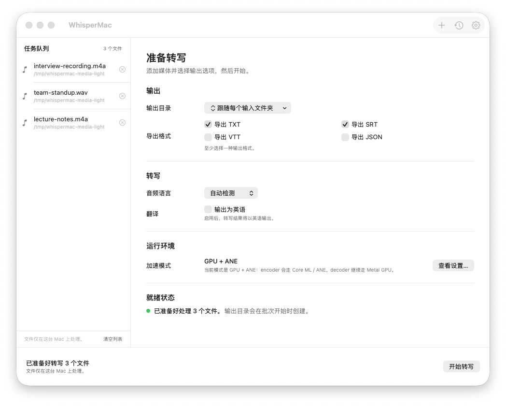
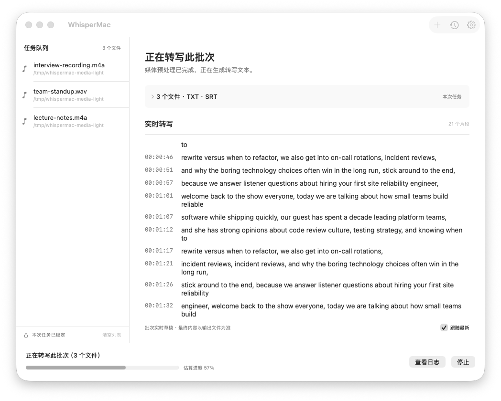
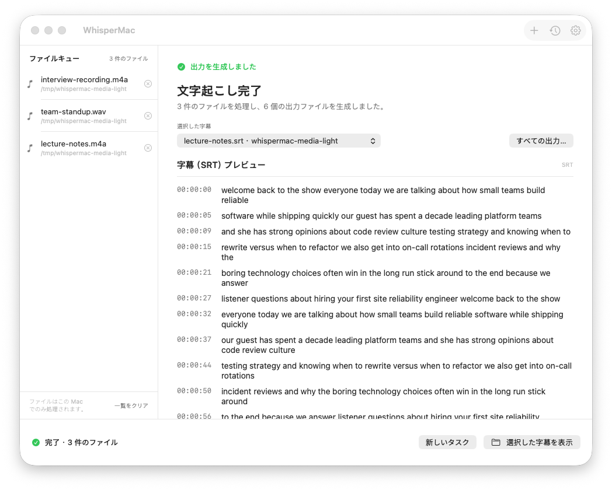

<div align="center">


# WhisperMac

**Free, local-first batch transcription for Apple Silicon Macs.**

Your media never leaves your Mac — powered by [whisper.cpp](https://github.com/ggml-org/whisper.cpp),
Metal GPU acceleration, and an optional Core ML / Apple Neural Engine encoder.

[English](README.md) · [简体中文](README.zh-CN.md)

<a href="https://github.com/sxsxsx-git/whispermac/releases">
  
</a>
<a href="https://github.com/sxsxsx-git/whispermac/stargazers">
  
</a>


<a href="LICENSE">
  
</a>

[Installation](docs/installation.md) · [FAQ](docs/faq.md) · [Comparison](docs/positioning.md) · [Contributing](CONTRIBUTING.md) · [Releases](https://github.com/sxsxsx-git/whispermac/releases)



**If this repo helps you, please star it ★ — that is the clearest signal the project is worth continuing.**

</div>

---

## ✨ Why WhisperMac

Most transcription tools make you choose: ship your files to a cloud service, or
assemble a `whisper.cpp` CLI workflow by hand. WhisperMac is the third path — a
**native macOS app** that runs the whole pipeline **locally**:

- 🔒 **Local-first** — transcription happens entirely on your Mac; no uploads, no accounts
- 🖥️ **A real Mac app** — SwiftUI interface with a batch queue, live transcript, and history, not a thin terminal wrapper
- ⚡ **Apple Silicon aware** — explicit `GPU (Metal)` and `GPU + ANE (Core ML)` runtime modes with honest reporting of which one is actually in effect
- 📦 **One-click runtime setup** — download the default model and Core ML encoder from inside the app, with checksum verification
- 🌐 **Localized UI** — English, 简体中文, 日本語

## 🎯 Features

| | Feature | Details |
| --- | --- | --- |
| 🗂 | **Batch queue** | Drag in MP4 / MOV / M4V / M4A / MP3 / WAV / AAC / FLAC, deduplicated, removable before start |
| 📄 | **Export formats** | `TXT` · `SRT` · `VTT` · `JSON` — pick any combination per task |
| 🏠 | **Sensible outputs** | By default each transcript lands next to its source file; or choose one shared output folder |
| ⚡ | **Acceleration modes** | `GPU only` (Metal) or `GPU + ANE` (Metal + Core ML encoder); missing encoder falls back to GPU with a notice |
| 📥 | **Built-in runtime download** | Downloads `ggml-large-v3-turbo` and its encoder archive from Hugging Face with SHA-256 verification, progress, and cancel |
| 📡 | **Live transcript** | Segments stream in while whisper works, with a follow-latest toggle |
| 👀 | **SRT preview** | Read the resulting subtitles in-app right after a batch finishes |
| 🕘 | **History** | The last 100 successful batches, one click to reveal in Finder |
| 🌍 | **Language control** | Auto-detect or pin the audio language; optional translate-to-English output |
| 🎹 | **Keyboard friendly** | `⌘O` to add media, full keyboard navigation |
| 🪟 | **Responsive layout** | The workspace adapts from the 980-px minimum window to full screen |
| 🔧 | **No FFmpeg needed** | Audio preprocessing uses the macOS built-in `afconvert` |

## 🚀 Quick Start

### Option A — Use a release build

1. Download the latest `WhisperMac-<tag>-app-only-macos-arm64.zip` from the
   [Releases page](https://github.com/sxsxsx-git/whispermac/releases).
2. Unzip and move `WhisperMac.app` to `/Applications` (or anywhere you like).
   If macOS blocks it, right-click → **Open**, or run `xattr -cr /path/to/WhisperMac.app`.
3. First launch: if the model is missing, click **Download default model…** —
   WhisperMac fetches and verifies it for you. You can also point the app at an
   existing `ggml` model in Settings.
4. Drag in your files, pick formats, press **Start Transcribing**.

### Option B — Build from source

```bash
git clone https://github.com/sxsxsx-git/whispermac.git
cd whispermac

# one-time toolchain + whisper.cpp runtime
xcode-select -s /Applications/Xcode.app
brew install cmake python@3.11
./scripts/setup-whispercpp.sh

# run it
swift run

# or build a double-clickable app at ./dist/WhisperMac.app
./scripts/build-app-bundle.sh
```

Daily-driver development shortcut: `./make-app.sh` refreshes a
`WhisperMac.app` right in the repository root.

> [!TIP]
> A model file (e.g. `ggml-large-v3-turbo.bin`) is required. The in-app
> downloader handles this; see the [Installation Guide](docs/installation.md)
> for manual placement and the optional Core ML encoder.

## ⚡ Performance Snapshot

On a single 47-minute sample file (same preprocessed WAV input, 120 s cooldown
between runs, passively cooled Apple Silicon MacBook Air):

| Mode | Time | Relative |
| --- | --- | --- |
| `GPU + ANE` | 177.62 s | ~15.5% faster |
| `GPU only` | 205.22 s | baseline |

This is **not** a universal benchmark — speed depends on model choice, media
content, thermals, and current `whisper.cpp` behavior.

## 🔍 How It Works

```
media files ──▶ afconvert (16 kHz mono WAV) ──▶ whisper-cli ──▶ TXT / SRT / VTT / JSON
                     macOS built-in               whisper.cpp        saved next to each
                                                  Metal (+ANE)       input by default
```

1. WhisperMac converts every input to 16 kHz mono PCM WAV using the macOS
   built-in `afconvert` — no FFmpeg dependency.
2. The whole batch runs through one `whisper.cpp` invocation on your machine.
3. On Apple Silicon, `GPU only` uses the Metal backend; `GPU + ANE` adds a
   Core ML encoder when a matching `ggml-large-v3-turbo-encoder.mlmodelc` is
   available.

> [!NOTE]
> ANE does not accelerate the full pipeline in current `whisper.cpp`: the Core
> ML path accelerates the **encoder**, while decoding still uses GPU/CPU.
> WhisperMac always reports the mode actually in effect.

## 📸 Interface

| Ready (中文) | Running | Complete (日本語) |
| :---: | :---: | :---: |
|  |  |  |

The window skeleton (toolbar / task queue / bottom action bar) stays put while
the right-hand workspace switches between setup, running, and result states.

## 🧭 Positioning

| | WhisperMac | Cloud transcription apps | Raw `whisper.cpp` CLI |
| --- | :---: | :---: | :---: |
| Files stay local | ✅ | ❌ | ✅ |
| GUI with batch queue | ✅ | ✅ | ❌ |
| Free & open source | ✅ | ❌ | ✅ |
| Explicit GPU/ANE modes | ✅ | varies | manual flags |
| Subtitle editing | ❌ | ✅ | ❌ |

Full comparison: [docs/positioning.md](docs/positioning.md).

## 📚 Documentation

- [Installation Guide](docs/installation.md) — releases, models, first run
- [FAQ](docs/faq.md)
- [Positioning & Comparison](docs/positioning.md)
- [Promotion Pack](docs/promotion-pack.md)
- [Contributing](CONTRIBUTING.md)

## 🤝 Contributing

Issues and pull requests are welcome. For development details, see
[CONTRIBUTING.md](CONTRIBUTING.md) — the test suite runs with `swift test`.

## ⭐ Star History

[](https://star-history.com/#sxsxsx-git/whispermac&Date)

## ⚠️ Known Limitations

- Apple Silicon only; Intel Macs are not a current target.
- The app does not auto-download `whisper-cli` (release builds bundle it;
  from source, run `./scripts/setup-whispercpp.sh`).
- `GPU + ANE` requires a matching Core ML encoder next to the selected model.
- Release artifacts are ad-hoc signed, not Developer-ID signed or notarized.
- Focused on transcription and export — not a subtitle editor.

## 📄 License

- Project license: **MIT** — see [LICENSE](LICENSE)
- Third-party notices: [THIRD_PARTY_NOTICES.md](THIRD_PARTY_NOTICES.md)

WhisperMac does not bundle or distribute FFmpeg.
