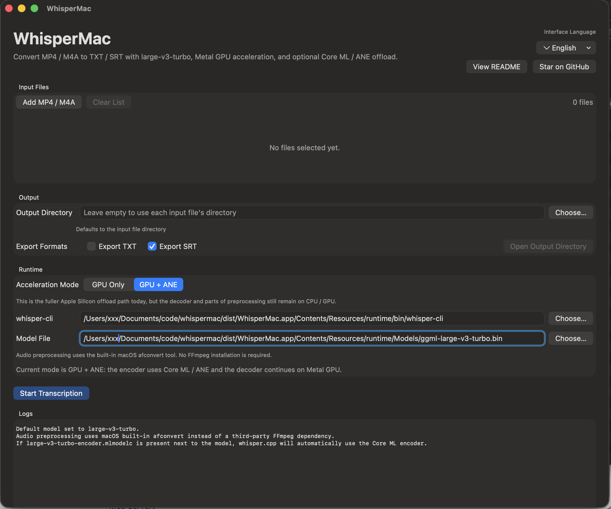

# WhisperMac

<p align="center">
  Free, local-first transcription for Apple Silicon Macs.
  <br />
  Convert MP4 / M4A to <code>txt</code> and <code>srt</code> with <code>whisper.cpp</code>,
  Metal GPU acceleration, and optional Core ML / ANE encoder offload.
</p>

<p align="center">
  <a href="https://github.com/sxsxsx-git/whispermac/releases">
    
  </a>
  
  
  
  <a href="LICENSE">
    
  </a>
</p>

<p align="center">
  <a href="docs/installation.md"><strong>Installation</strong></a>
  ·
  <a href="docs/faq.md"><strong>FAQ</strong></a>
  ·
  <a href="docs/positioning.md"><strong>Comparison</strong></a>
  ·
  <a href="CONTRIBUTING.md"><strong>Contributing</strong></a>
  ·
  <a href="https://github.com/sxsxsx-git/whispermac/releases"><strong>Releases</strong></a>
</p>

<p align="center">
  If this repo helps you, please star it. That is the clearest signal that the
  project is useful and worth continuing.
</p>



## Why WhisperMac

WhisperMac is a native macOS app for people who want local transcription without
shipping their files to a cloud service or assembling a command-line workflow by
hand.

- Local-first: your media stays on your Mac
- Native SwiftUI app, not just a thin terminal wrapper
- Built for Apple Silicon with clear `GPU only` and `GPU + ANE` runtime modes
- Practical transcript export in `txt` and `srt`
- Uses macOS built-in `afconvert`, so FFmpeg is not required
- Localized UI in English, Simplified Chinese, and Japanese

## Highlights

| Feature | What you get |
| --- | --- |
| Native workflow | Add local files, choose output formats, and start transcription from a macOS UI |
| Local runtime | Runs `whisper.cpp` through `whisper-cli` on your machine |
| Acceleration modes | Switch between `GPU only` and `GPU + ANE` when a compatible Core ML encoder is present |
| Output | Export plain text and subtitle files for practical downstream use |
| Visibility | Real-time progress plus filtered logs for status and debugging |
| Sensible preprocessing | Audio conversion uses macOS `afconvert` instead of a bundled FFmpeg dependency |

## Quick Start

1. Read the [Installation Guide](docs/installation.md).
2. Download the latest app-only arm64 release asset if one exists. Otherwise,
   build from source.
3. Prepare `ggml-large-v3-turbo.bin`.
4. Add `ggml-large-v3-turbo-encoder.mlmodelc` only if you want `GPU + ANE`
   mode.
5. Open WhisperMac, add your files, choose export formats, and start
   transcribing.

Before you try it:

- The current target is `macOS 14+` on Apple Silicon.
- Release packaging is currently `app-only`: models are not bundled.
- Signed and notarized releases are not set up yet.

## Performance Snapshot

On a single `47m 09s` sample file, using the same preprocessed WAV input and a
`120s` cooldown between runs on a passively cooled Apple Silicon MacBook Air,
the measured results were:

- `GPU + ANE`: `177.62s`
- `GPU only`: `205.22s`

In that specific run, `GPU + ANE` was about `15.5%` faster than `GPU only`.
This is not a universal benchmark. Actual speed depends on model choice, media
content, thermals, and current `whisper.cpp` behavior.

## How It Works

1. WhisperMac converts input media to `16 kHz`, mono, PCM WAV with macOS
   `afconvert`.
2. It runs `whisper.cpp` through `whisper-cli`.
3. On Apple Silicon:
   - `GPU only` uses the Metal backend.
   - `GPU + ANE` uses Metal plus a Core ML encoder when a compatible
     `ggml-large-v3-turbo-encoder.mlmodelc` is available.

Important limitation:

- ANE does not accelerate the full transcription pipeline in the current
  `whisper.cpp` architecture. The Core ML path typically accelerates the
  encoder, while decoding and other work still use GPU and CPU resources.

## Runtime Assets

Expected default runtime assets:

- `Models/ggml-large-v3-turbo.bin`
- `Models/ggml-large-v3-turbo-encoder.mlmodelc` (optional, for `GPU + ANE`)
- `.build-tools/whisper.cpp/build/bin/whisper-cli`

If these assets exist, the bundle script copies them into the app under
`Contents/Resources/runtime`.

## Documentation

- [Installation Guide](docs/installation.md)
- [FAQ](docs/faq.md)
- [Positioning and Comparison](docs/positioning.md)
- [Promotion Pack](docs/promotion-pack.md)
- [Contributing](CONTRIBUTING.md)

## Developer Setup

Install local build dependencies:

```bash
xcode-select -s /Applications/Xcode.app
brew install cmake python@3.11
```

Prepare the runtime:

```bash
./scripts/setup-whispercpp.sh
./scripts/prepare-model.sh
```

Run the app in development:

```bash
swift run
```

Build the app bundle:

```bash
./scripts/build-app-bundle.sh
```

The generated app bundle is written to:

```text
./dist/WhisperMac.app
```

Build and test locally:

```bash
swift build
swift test
```

## Known Limitations

- Apple Silicon only. Intel Macs are not a current target.
- Built-in model download is not implemented yet.
- `GPU + ANE` depends on a compatible Core ML encoder being present next to the
  selected `ggml` model.
- ANE does not accelerate the full transcription pipeline.
- The app focuses on transcription and export, not subtitle editing.
- Release artifacts are not yet signed or notarized.
- The current release packaging flow creates an app-only zip and strips bundled
  models from the archive.

## License

- Project license: `MIT`, see [LICENSE](LICENSE)
- Third-party notices: see [THIRD_PARTY_NOTICES.md](THIRD_PARTY_NOTICES.md)

WhisperMac does not bundle or distribute FFmpeg.
