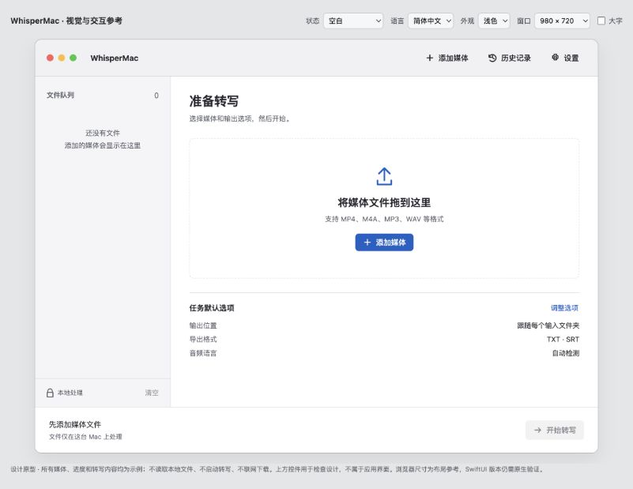
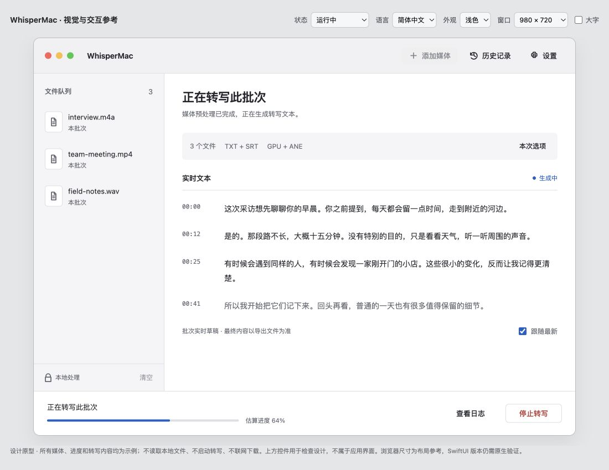
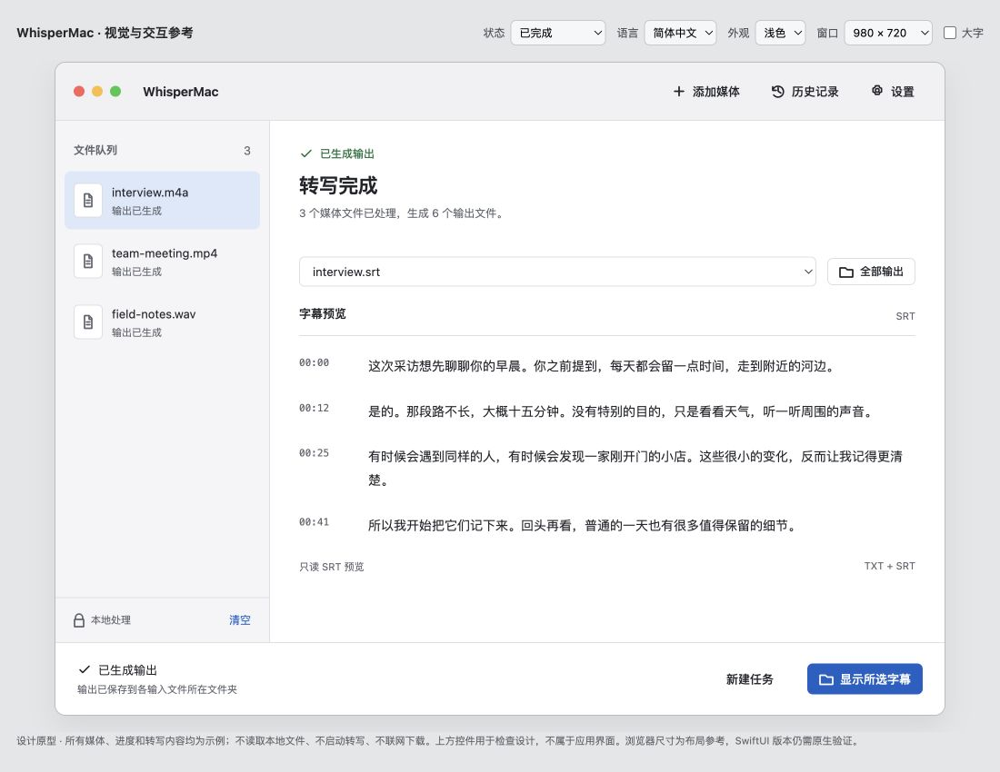

# WhisperMac 视觉交接包

更新：2026-09-07。以下图片和交互均为设计参考，不是当前 SwiftUI 应用截图。

## 从这里开始

1. 阅读 [UI 改进执行计划](../ui-improvement-plan.zh-CN.md)，确定实施阶段。
2. 阅读 [视觉与状态规格](../ui-visual-spec.zh-CN.md)，确定布局、字体、颜色和动作层级。
3. 在浏览器打开 [交互原型](whispermac-ui-prototype.html)，检查状态变化，而不只对照静态图片。
4. 阅读本页的验证记录和限制，再实现 SwiftUI。

原型是单文件，无构建步骤、无外部字体或脚本依赖。可以直接打开文件；也可以在仓库根目录执行 `python3 -m http.server 8768 --bind 127.0.0.1 --directory docs/design`，然后访问 `http://127.0.0.1:8768/whispermac-ui-prototype.html`。

上方实验台提供 9 种状态、三种语言、深浅色、两档窗口尺寸和大字模式。实验台不属于产品界面；其中“完成”会载入固定的三文件 TXT/SRT 成功样例，“完成 / 无 SRT”会载入 TXT 样例。不会实际读取文件、转写或下载模型。

## 三种主状态

### 空白：让下一步清楚

主区只有添加入口和三个默认选项摘要；工具栏保留添加、历史、设置。底栏明确解释为何不能开始。完整配置在添加文件后出现。

### 运行：把空间交给内容

全高文件队列保持位置，主区呈现批次摘要和实时文本。底栏只放一个批次估算进度与停止动作，避免与配置表争夺空间。

### 完成：预览结果，再明确操作对象

主区显示所选 SRT 的只读预览；“全部输出”列出示例产物。主动作明确为“显示所选字幕”，不把多个输出目录含糊地指向一个文件夹。

## 补充设计

- [有文件后的准备表单](ui-ready-light.png)：四种格式分两行，语言与翻译分组，低频路径进入设置。
- [深色运行状态](ui-running-dark.png)：独立的深色表面与文字色，不靠整体反色。
- [缺少模型](ui-missing-model.png)：首次无文件且缺模型时，准备资源成为主动作，添加文件保留在工具栏。

## 已执行的原型验证

验证日期：2026-09-07。浏览器视口为 1100×850 CSS px，内部应用窗口实测为 980×720 CSS px。截图保留实验台及“示例”说明；CSS px 的测量不能替代 macOS point 和系统窗口框架验证。

| 检查 | 结果与边界 |
| --- | --- |
| 9 状态 × EN/ZH/JA × 浅/深色，共 54 组 | DOM 尺寸检查均未发现主区横向溢出、工具栏溢出、底栏按钮越界或 `undefined` 文案。不是 54 组完整可用性测试。 |
| 9 状态 × EN/ZH/JA × 大字，共 27 组 | 浅色模式下上述几何检查通过；大字时主区允许垂直滚动，底栏增至 96 px。未声称通过原生动态字体测试。 |
| 视觉查看 | 实际查看空白、准备、运行、完成、深色运行及日文大字准备画面；保存 6 张参考图。 |
| 最后一个输出格式 | 取消 TXT 后，唯一剩余的 SRT 被禁用，并保留邻近原因说明；重新选择 TXT 后可恢复操作。 |
| 缺模型 → 添加 → 下载 → 取消下载 | 已加入的示例队列保持不变。 |
| 完成 → 新建任务 | 返回可编辑准备态，保留队列，不自动启动。 |
| 运行 → 停止 | 进入独立取消态，提供“重新开始”，不显示成功或 100%。 |
| 全部输出 | TXT/SRT 成功样例显示 6 个输出路径及逐项显示入口。 |
| 设置 → 帮助 | 帮助内容正常打开；Esc 关闭对话框。未自动访问外部链接。 |
| 浏览器控制台 | 检查时没有记录到 error/warn。 |
| 脚本静态检查 | 原型脚本经 `node --check` 通过。 |

## 尚未由原型证明的事项

- 真实文件选择、Finder 定位、下载和错误恢复均是模拟；“选择…”和 Finder 动作只显示演示反馈。
- 拖放载入示例队列，不解析实际拖入文件。真实去重、编码支持、路径权限及其反馈仍须在 SwiftUI 中实现、验证。
- 实时文本固定展示四段样例，“跟随最新”只展示开关状态，没有持续文本流来验证自动滚动。
- 未实现完整的缺 CLI、GPU 回退、下载失败、取消中的视觉样例；规格中的这些分支仍是后续原生验收要求。
- 未做真实 VoiceOver 听读、系统高对比度或动态字体验证；浏览器辅助功能树可读取标签，不等于原生无障碍通过。
- 未实测 50 项队列，也未验证 1200×800 档所有组合；长文件名的原型采用尾部省略，原生实现应按规格保留扩展名并提供完整路径。
- 本轮未修改 Swift 源码，也未用此原型证明模型转写、历史持久化、通知或文件写入行为正确。

## 给执行 AI 的最后提醒

继承原生 macOS 控件和语义色，保留这里的比例与层级；不要逐像素复制浏览器控件、假交通灯或实验台。以规格为设计依据，以当前源码和真实报告为数据依据，完成后补交原生截图与验证记录。
